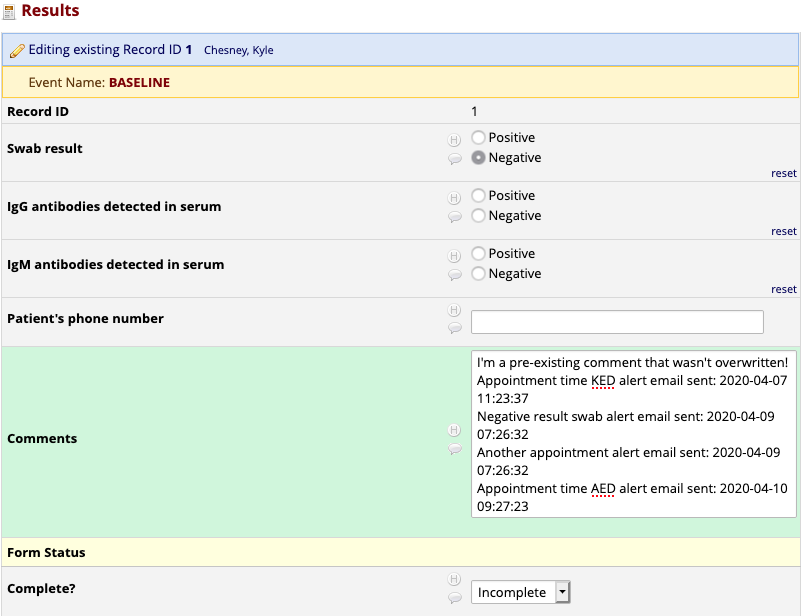

# Copy Email Alert Log to Field

Copy Email Alert Log to Field is a REDCap module to copy email alert log entries into a user-defined REDCap text field. This exposes the name and date of alerts to anyone who can read the form where the configured text field is defined and makes the data available for easy export with the rest of the REDCap data.

## Prerequisites
- REDCap >= 9.3.5

## Installation
- Clone this repo into to `<redcap-root>/modules/copy_email_alert_log_to_field_v0.0.0`.
- Go to **Control Center > Manage External Modules** and enable Copy Email Alert Log to Field
- For each project you want to use this module, go to the project home page, click on **Manage External Modules** link, and then enable Copy Email Alert Log to Field for that project.

## Configuration

- **Field to pipe alert log**: Select a field to write email alert logs into. The chosen field **must exist** in each REDCap event where you would like to capture alerts.
- **Search all alerts on next run**: Check this box to search the log of all alerts on the next run for alert history to copy into the field. This switch is recommended only if you are enabling this module on a project which has already sent email alerts out. As it should only be needed once, this switch turns itself off after running once. 

## Testing and development

If you would like to test this module or do development work on it, [examples/test_project_1.xml](examples/test_project_1.xml) is an example longitudinal project that provides a data collection form, 5 events, 4 independently triggerable alerts, and a text field to write the alert logs into. To use it, create the project from the XML file, then follow the _Installation_ instructions above to setup the module. Any form save event will trigger at least one alert to fire. Others can be fired by selecting "Yes" on the appropriate fields in the form. All emails in the email alerts are sent from and also to the bogus email address `you@example.org`. That might require some reconfiguration in your test environment.

Note that this module runs via REDCap Cron. If you are testing in a system that does not have REDCap Cron activated, you will need to call it manually. As this module's cron job is configured to run ever 60 seconds, you cannot refresh the alert log field any faster than once per minute.
